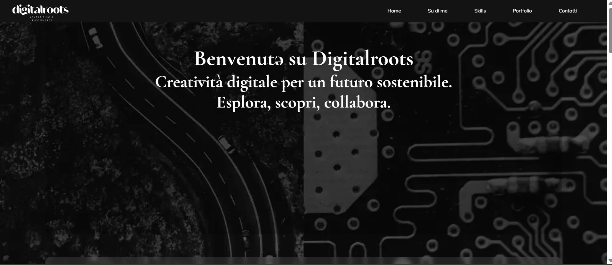
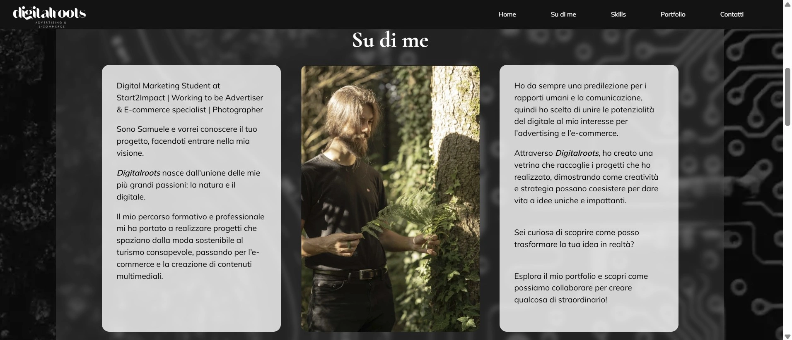
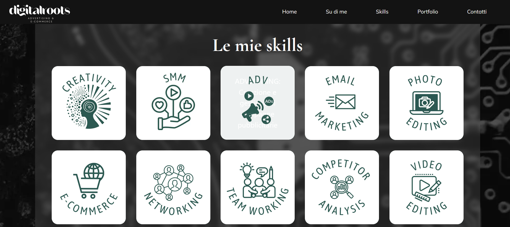
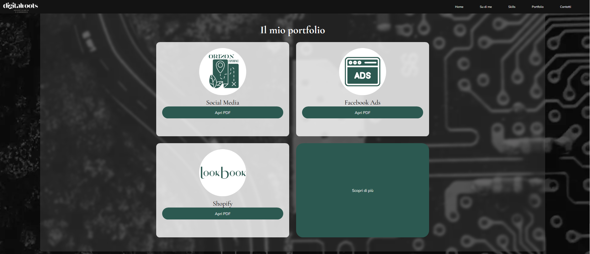
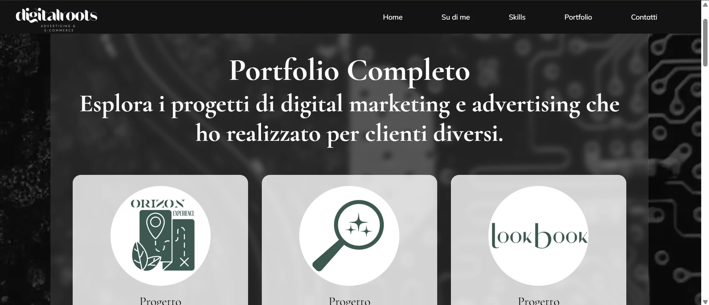

# Digitalroots - Portfolio Professionale  
  
<span role="text" aria-label="Titolare">Samuele Delle Monache | Digital Marketing Specialist & E-commerce Strategist</span>


---

## 🍃 Cos'è Digitalroots? {aria-labelledby="cos-e-digitalroots"}
<div role="region" aria-labelledby="cos-è-digitalroots">
Il mio portfolio professionale che unisce:
- 15+ progetti reali (2023/2024)
- Risultati concreti di campagne advertising
- Strategie social media misurabili
- Soluzioni e-commerce su misura
</div>

---

## ✨ Funzionalità principali {aria-labelledby="funzionalita"}
<div role="region" aria-labelledby="funzionalita">
- **Case study dettagliati** con PDF scaricabili
- **Design responsive** per tutti i dispositivi
- **Accessibilità certificata** WCAG 2.1 AA
- **Performance ottimizzate** (1.2s loading time)
- **Dark mode automatica** basata sul sistema
</div>

---

## 🛠 Tecnologie utilizzate {aria-labelledby="tecnologie"}
<div role="region" aria-labelledby="tecnologie">
<div role="table" aria-label="Tabella tecnologie utilizzate">

| Sezione         | Tecnologia                | File         |
|-----------------|---------------------------|--------------|
| Animazioni      | CSS Transitions           | style.css    |
| Tooltip         | Vanilla JS                | script.js    |
| Form            | Formspree + HTML5         | index.html   |


</div>

**Ottimizzazione:** 
- Immagini WebP/AVIF
- Critical CSS in-line
- Lazy loading nativo

**Strumenti:**  
- Formspree per i contatti
- GitHub Pages (hosting)
- Lighthouse per testing

---

## 🚀 Come visualizzare {aria-labelledby="visualizza"}
1. Clona il repository:
```bash
git clone https://github.com/samueledellemonache/Digitalroots.git
```
2. Apri `index.html` con qualsiasi browser
---

## 📂 Struttura files {aria-labelledby="struttura"}
<div role="region" aria-labelledby="struttura">
<pre role="document" aria-label="Struttura directory">

DIGITALROOTS/
├── assets/
│   ├── media/    # Immagini ottimizzate
|       └── screenshots/ # Solo per file README.md
│   ├── scripts/  # Funzionalità base
│   └── styles/   # CSS organizzato
├── index.html    # Homepage principale
├── portfolio/    # Dettagli progetti
└── README.md

---

##🌱 Sostenibilità  {aria-labelledby="sostenibilita"}
<div role="region" aria-labelledby="sostenibilita">
  
-Hosting eco-friendly

-Font leggeri (WOFF2)

-Cache ottimizzata - 
<span role="text" aria-label="Impronta ecologica"> 0.20g CO2/visita (79% meno della media) </span>
 ([Verifica su Website Carbon](https://www.websitecarbon.com)) 
 </div>

---

## 🔍 Ottimizzazione SEO  {aria-labelledby="seo"}

<div role="region" aria-labelledby="seo"> 
- Meta tag dinamici
- Lazy loading immagini
- Sitemap automatica
</div>

---

## 📮 Contatti {aria-labelledby="contatti"}
<div role="region" aria-labelledby="contatti">

**Email:** [samuele.digitalroots@gmail.com](mailto:samuele.digitalroots@gmail.com) 

**Telefono:**  <span role="text" aria-label="Numero di telefono">+39 3923574954</span> 

**Indirizzo:** <span role="text" aria-label="Indirizzo fisico">Via delle Piaggarelle, 26 - 01100 Viterbo</span>


[Facebook](https://www.facebook.com/people/Samuele-Delle-Monache/100011033235684/)
      
[Instagram](https://www.instagram.com/samuele_dellemonache/)

</div>
---

## 💻 Competenze {aria-labelledby="competenze"}
<div role="region" aria-labelledby="competenze"> 
- Digital Advertising
- Analisi dati (GA4/GTM)
- Conversion Rate Optimization
- UX/UI Essentials
- E-commerce management
</div>

---
## 🖼 Anteprime del sito {aria-labelledby="anteprime"}

<div role="region" aria-labelledby="anteprime">
  <h2 id="anteprime" class="visually-hidden">Anteprime del sito</h2>

  <section role="group" aria-labelledby="homepage-heading">
    <h3 id="homepage-heading">Homepage</h3>
    <figure role="figure" aria-labelledby="homepage-caption">
      
      <figcaption id="homepage-caption">
        Vista completa della homepage - <span id="homepage-desc">Layout moderno con header fisso, card progetti interattive e footer responsive</span>
      </figcaption>
    </figure>
  </section>

  <section role="group" aria-label="Sezioni principali">
    <div role="list">
      <div role="listitem">
        <figure role="figure" aria-labelledby="about-caption">
          
          <figcaption id="about-caption">Presentazione personale con dettagli professionali</figcaption>
        </figure>
      </div>
      <div role="listitem">
        <figure role="figure" aria-labelledby="skills-caption">
          
          <figcaption id="skills-caption">Rappresentazione visiva delle principali competenze</figcaption>
        </figure>
      </div>
      <div role="listitem">
        <figure role="figure" aria-labelledby="portfolio-caption">
          
          <figcaption id="portfolio-caption">Raccolta organizzata dei lavori realizzati</figcaption>
        </figure>
      </div>
    </div>
  </section>

  <section role="group" aria-labelledby="portfolio-page-heading">
    <h3 id="portfolio-page-heading">Pagina Portfolio</h3>
    <figure role="figure" aria-labelledby="portfolio-detail-caption">
      
      <figcaption id="portfolio-detail-caption">
        Case study approfondito - <span id="portfolio-detail-desc">Visualizzazione dati performance, processi lavorativi e risultati ottenuti</span>
      </figcaption>
    </figure>
  </section>
</div>
---

*"Dal digitale alle radici concrete"* 🌱  
© 2024 Samuele Delle Monache
